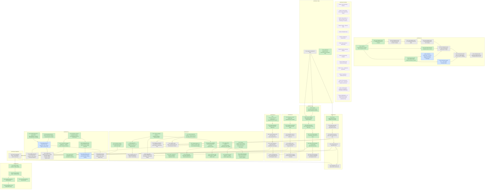

# Task DAG

Generated by `python3 work/tools/work.py dag` — do not edit by hand.

```mermaid
graph TD
  classDef todo fill:#e8e8e8,stroke:#999,color:#333
  classDef doing fill:#cfe3ff,stroke:#4a90d9,color:#1a3c6e
  classDef review fill:#ffe9b8,stroke:#d9a441,color:#6e4f1a
  classDef done fill:#cdeec9,stroke:#57a05a,color:#1e4d20
  classDef blocked fill:#f5c6c6,stroke:#c0504d,color:#5e1f1d
  classDef backlog fill:#f4f0fa,stroke:#b0a3c9,color:#4a3d63,stroke-dasharray: 4 3
  subgraph WS_A["workstream A"]
    T_A1["T-A1: Freeze dag_schema.md and scaffold services/dag/"]:::done
    T_A2["T-A2: Node runner with context packs and dag_planner prompt"]:::todo
    T_A3["T-A3: Human-in-the-loop gate nodes and autonomy dial"]:::todo
    T_A4["T-A4: Verify nodes and DAG MCP tools"]:::todo
    T_A5["T-A5: Integration day - run demo mission end-to-end"]:::todo
  end
  subgraph WS_B["workstream B"]
    T_B1a["T-B1a: Freeze sourcing_schema.md and extend VendorPart schema"]:::done
    T_B1b["T-B1b: Nexar, Digi-Key, and Mouser provider implementations"]:::done
    T_B2["T-B2: BOM rollup with bom_rollup and bom_price MCP tools"]:::done
    T_B3["T-B3: Cost model (material + machining) and quote-out tools"]:::done
    T_B4["T-B4: Spec-sheet matching v1 - deterministic BOLTS/KiCad lookup"]:::done
    T_B5["T-B5: Spec-sheet matching v2 - AI path from datasheet and integration demo"]:::todo
  end
  subgraph WS_C["workstream C"]
    T_C1["T-C1: firmware_rpc.md contract and engine/firmware/ scaffold"]:::done
    T_C2["T-C2: Compile loop and pin-map header from ECAD netlist"]:::done
    T_C3["T-C3: Emulation loop via Renode with fw_sim_run MCP tool"]:::todo
    T_C4["T-C4: Hardware path - probe-rs flash/debug and clangd LSP tools"]:::todo
    T_C5["T-C5: firmware.md agent prompt and demo firmware in Renode"]:::todo
  end
  subgraph WS_D["workstream D"]
    T_D1["T-D1: structural_schema.md contract and engine/structural/ scaffold"]:::done
    T_D2["T-D2: PyNite integration - member forces and deflections"]:::done
    T_D3["T-D3: Section libraries, D/C ratio checks, and struct_check MCP tool"]:::todo
    T_D4["T-D4: Code compliance - agentic RAG and deterministic rule engine"]:::todo
    T_D5["T-D5: Cost takeoff and struct_estimate MCP tool with integration demo"]:::todo
  end
  subgraph WS_E["workstream E"]
    T_E1["T-E1: Piping module scaffold + fitting catalog"]:::done
    T_E2["T-E2: 1D pipe network solver + pressure drop"]:::done
    T_E3["T-E3: Gas/heat networks + fluid properties"]:::done
    T_E4["T-E4: 3D CFD handoff for pipe internals"]:::done
    T_E5["T-E5: Oil-hydraulic circuit design (ISO 1219)"]:::done
  end
  subgraph WS_F["workstream F"]
    T_F1["T-F1: Freeze research_tools contract, scaffold engine/research with web_search + fetch_page"]:::done
    T_F10["T-F10: gsl-ser/v1 serialization freeze + slot-fidelity eval harness + dataset factory"]:::done
    T_F11["T-F11: Translator SFT v0 + GRPO groundedness polish + local serving"]:::todo
    T_F12["T-F12: dag_replan, workflow templates, and the design_review verify battery"]:::todo
    T_F13["T-F13: Micro-evaluator 1 - feature-recognition hypothesis ranker"]:::done
    T_F14["T-F14: Deliverables contract + services/deliverables scaffold with OSS engines"]:::done
    T_F15["T-F15: Engineering deliverable templates v1 with provenance joins"]:::done
    T_F16["T-F16: Universal in-app preview pane + Copilot artifact cards"]:::done
    T_F17["T-F17: Mission-control UX - live plan/action stream, steer-anytime, design-brief flow"]:::todo
    T_F2["T-F2: Research source helpers v1 + unified material registry seed"]:::done
    T_F3["T-F3: Freeze interaction contract - ask_user core, in-app dialog, MCP elicitation"]:::done
    T_F4["T-F4: Migrate intake, clarify, and DAG gates onto the interaction contract"]:::todo
    T_F5["T-F5: Image ingestion v1 - real files, provider image slots, fiducial metrology"]:::done
    T_F6["T-F6: Guided multi-photo capture, phone handoff, photogrammetry to reverse_engineer"]:::done
    T_F7["T-F7: Freeze narration contract + describe_toolpaths + describe_results"]:::done
    T_F8["T-F8: describe_assembly, describe_board (GSL promotion), describe_project"]:::done
    T_F9["T-F9: Providers contract, tool registry/allow-listing, session-auth spike"]:::done
  end
  subgraph WS_G["workstream G"]
    T_G1["T-G1: Land the uncommitted GUI working tree in scoped commits"]:::done
    T_G10["T-G10: ShopCraft rename tiers 2+3 - build targets, env vars, MCP id, appdata"]:::todo
    T_G11["T-G11: Windows build verify, then delete host/ and all deprecated GUI code"]:::todo
    T_G12["T-G12: Human UI walkthrough - recursive element-by-element feedback loop until converged"]:::doing
    T_G2["T-G2: Restore doc-tab input, shrink Copilot header, PM button contrast"]:::done
    T_G3["T-G3: ShopCraft rename tier 1 - user-visible branding strings"]:::doing
    T_G4["T-G4: GUI dead-code and cleanliness pass on host/"]:::done
    T_G5["T-G5: GUI migration wave 1 - foundation libs (F1-F4 + G1 gate)"]:::done
    T_G6["T-G6: GUI migration wave 2 - shell chrome (S1-S6, H5 start, G2 gate)"]:::todo
    T_G7["T-G7: GUI migration wave 3 - core panels (C1-C6, G3 gate)"]:::todo
    T_G8["T-G8: GUI migration wave 4 - hard subsystems (H1-H5, G4 gate)"]:::todo
    T_G9["T-G9: GUI migration wave 5 - polish, parity battery, cutover (P1, P2, G5)"]:::todo
  end
  subgraph WS_H["workstream H"]
    T_H1["T-H1: Telemetry contract - AI-artifact envelope, accept/edit/reject capture, consent tiers"]:::done
    T_H10["T-H10: Offline VLM track v0 - base pick eval, synthetic render corpus, render-grounded RL"]:::todo
    T_H11["T-H11: Regen-error diagnosis (IP-18) - frontier ship with logging, corruption corpus, migration gate"]:::todo
    T_H2["T-H2: Canonical doc serialization policy + semantic doc_diff tool"]:::done
    T_H3["T-H3: Requirements layer - freeze aicad.req/1 schema + requirements doc CRUD"]:::done
    T_H4["T-H4: Verifier battery API + gap verifiers (groundedness, manifold, unit sanity, dim coverage)"]:::done
    T_H5["T-H5: Training data store - consent-filtered exporter, DVC versioning, Argilla audit gate"]:::done
    T_H6["T-H6: Fleet training runner - claim-based job queue, cross-OS profiles, MLflow tracking"]:::doing
    T_H7["T-H7: Frontier-API logging middleware + shadow-mode comparison harness"]:::done
    T_H8["T-H8: Product-task eval benchmark suite (elicitation, spec->sketch, regen-fix, CAM, VLM)"]:::doing
    T_H9["T-H9: Adapter serving - vLLM per-task LoRA routing, canary rollout, rollback story"]:::todo
  end
  subgraph WS_backlog["workstream backlog"]
    T_BL01["T-BL01: V&V benchmark harness"]:::backlog
    T_BL02["T-BL02: Format interop track (reverse-engineering intake)"]:::backlog
    T_BL03["T-BL03: Intake Gates 1-3 (process profiles, photo metrology, fit coupons)"]:::backlog
    T_BL04["T-BL04: Fatigue + thermal FEA"]:::backlog
    T_BL05["T-BL05: FPGA/HDL flow"]:::backlog
    T_BL06["T-BL06: Certified-tool escape hatch"]:::backlog
    T_BL07["T-BL07: Wire harness / cable design"]:::backlog
    T_BL08["T-BL08: Tolerance stack-up analysis"]:::backlog
    T_BL09["T-BL09: Requirements manager"]:::backlog
    T_BL10["T-BL10: PDM-lite (git-backed revisioning)"]:::backlog
    T_BL11["T-BL11: Docs + compliance generation"]:::backlog
    T_BL12["T-BL12: TraceParts + Werk24 paid tiers"]:::backlog
    T_BL13["T-BL13: Per-document glass accent + luminance-variance scrim boost"]:::backlog
    T_BL14["T-BL14: GNN adapter training for GO families + sw_fixtures STEP export"]:::backlog
    T_BL15["T-BL15: PROPOSAL — in-app document version control (needs human refinement first)"]:::backlog
  end
  subgraph WS_integration["workstream integration"]
    T_INT["T-INT: Day-5 integration demo - soil-moisture sensor end-to-end"]:::todo
  end
  subgraph WS_setup["workstream setup"]
    T_S1["T-S1: Apply for vendor API keys"]:::todo
    T_S2["T-S2: Land the AI-experience lane (recon/GSL) uncommitted files"]:::done
  end
  T_S1 --> T_A1
  T_A1 --> T_A2
  T_A2 --> T_A3
  T_A3 --> T_A4
  T_A4 --> T_A5
  T_INT --> T_A5
  T_S1 --> T_B1a
  T_B1a --> T_B1b
  T_S1 --> T_B1b
  T_B1b --> T_B2
  T_B2 --> T_B3
  T_B3 --> T_B4
  T_B4 --> T_B5
  T_C1 --> T_C2
  T_C2 --> T_C3
  T_C3 --> T_C4
  T_C4 --> T_C5
  T_D1 --> T_D2
  T_D2 --> T_D3
  T_D3 --> T_D4
  T_D4 --> T_D5
  T_B2 --> T_D5
  T_INT --> T_E1
  T_E1 --> T_E2
  T_E2 --> T_E3
  T_E2 --> T_E4
  T_E3 --> T_E5
  T_F7 --> T_F10
  T_F10 --> T_F11
  T_A4 --> T_F12
  T_F7 --> T_F12
  T_F14 --> T_F15
  T_F14 --> T_F16
  T_A3 --> T_F17
  T_F3 --> T_F17
  T_F1 --> T_F2
  T_F3 --> T_F4
  T_A3 --> T_F4
  T_F5 --> T_F6
  T_F7 --> T_F8
  T_G9 --> T_G10
  T_G3 --> T_G10
  T_G10 --> T_G11
  T_G2 --> T_G12
  T_G1 --> T_G2
  T_G2 --> T_G3
  T_G1 --> T_G4
  T_G1 --> T_G5
  T_G5 --> T_G6
  T_G6 --> T_G7
  T_G7 --> T_G8
  T_G8 --> T_G9
  T_G4 --> T_G9
  T_G12 --> T_G9
  T_F5 --> T_H10
  T_H8 --> T_H10
  T_H7 --> T_H11
  T_H8 --> T_H11
  T_H1 --> T_H5
  T_H5 --> T_H6
  T_H1 --> T_H7
  T_H3 --> T_H8
  T_H4 --> T_H8
  T_F9 --> T_H9
  T_H8 --> T_H9
  T_A4 --> T_INT
  T_B4 --> T_INT
  T_C4 --> T_INT
  T_D4 --> T_INT
```
